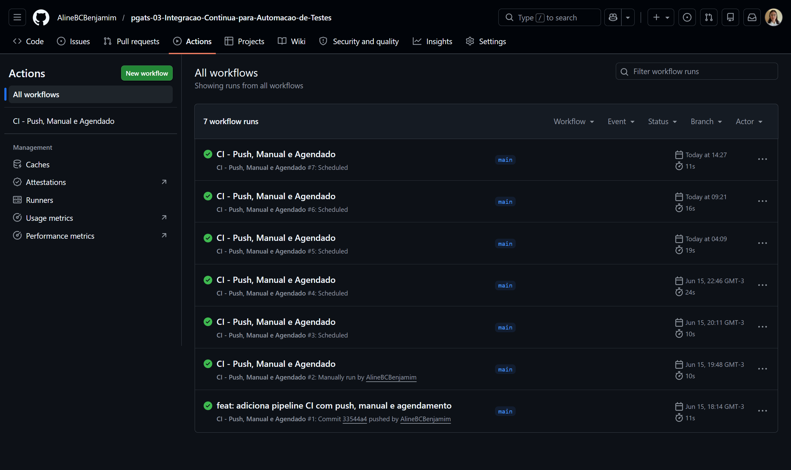
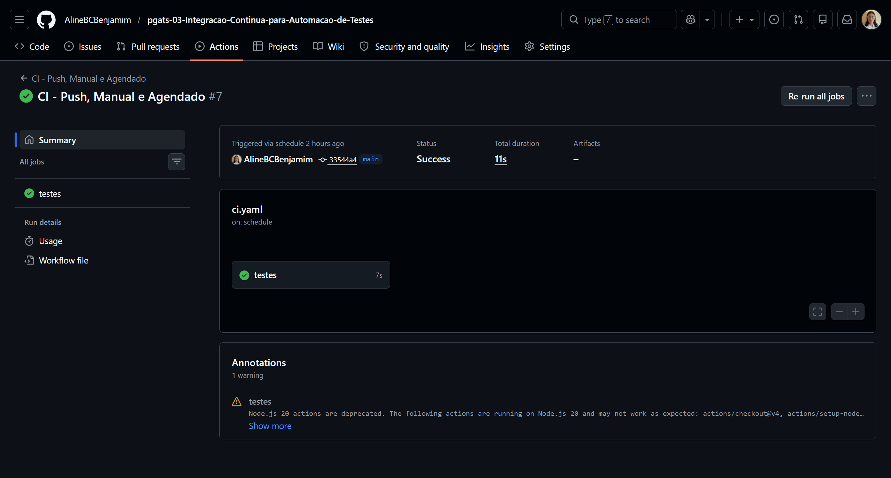
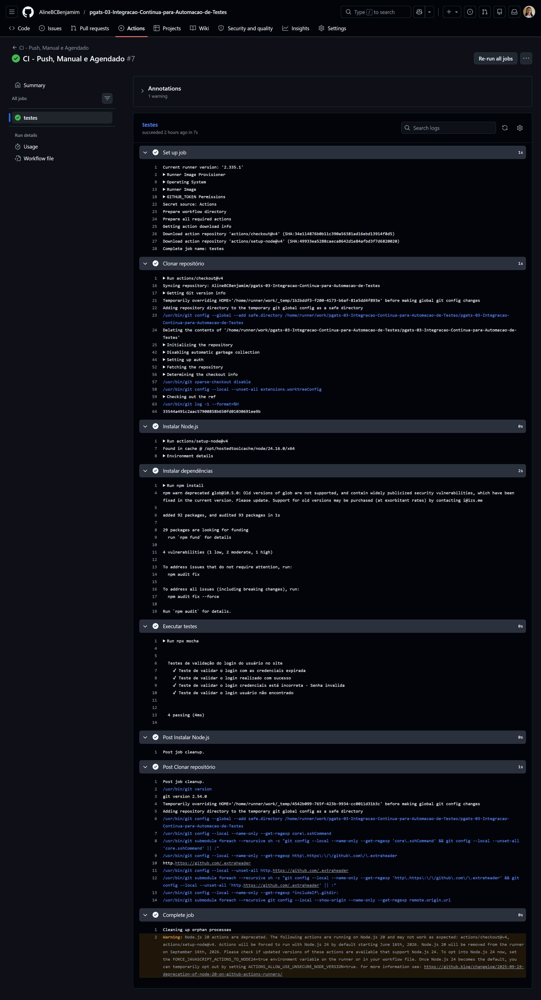
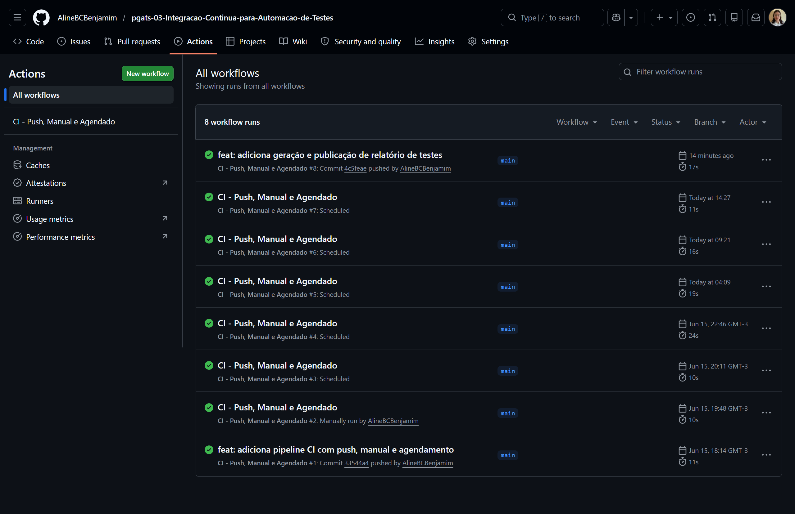
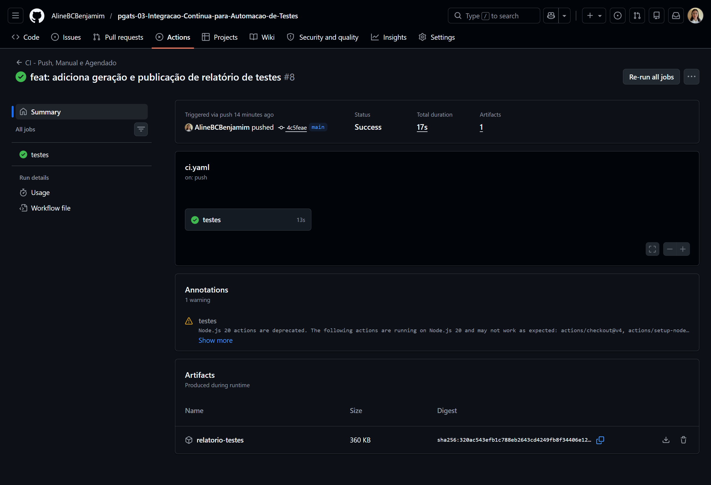
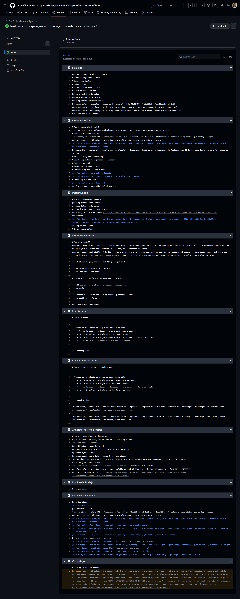
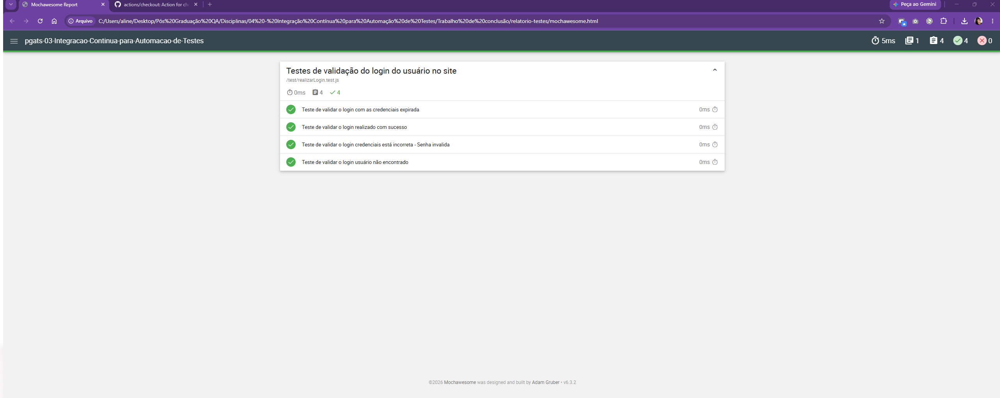

## Trabalho de Conclusão de Disciplina – Integração Contínua com GitHub Actions.

### Objetivo
Desenvolver uma pipeline de integração contínua utilizando GitHub Actions para execução automatizada de testes, contemplando:
• Execução por push.
• Execução manual.
• Execução agendada (schedule).
• Geração de relatório de testes.
• Armazenamento/publicação do relatório na pipeline.
O projeto utilizado foi desenvolvido anteriormente na disciplina de Programação para Automação de Testes e consiste na validação de login de usuários utilizando JavaScript e testes automatizados com Mocha.
________________________________________
## Tecnologias Utilizadas
- Node.js
Ambiente de execução JavaScript utilizado para executar a aplicação e os testes.
Referência: <https://nodejs.org/docs/latest/api/>

- Mocha
Framework utilizado para criação e execução dos testes automatizados.
Referência: <https://mochajs.org/>

- Mochawesome
Biblioteca utilizada para geração de relatórios de testes em HTML e JSON.
Referência: <https://github.com/adamgruber/mochawesome>

- GitHub Actions
Ferramenta utilizada para implementação da pipeline de integração contínua.
Referência: <https://docs.github.com/actions>
________________________________________
## Funcionamento da Aplicação
A aplicação possui uma função responsável por validar o login de usuários cadastrados.
As validações implementadas são:
• Login realizado com sucesso.
• Credenciais expiradas.
• Senha incorreta.
• Usuário não encontrado.
________________________________________
## Testes Automatizados
Os testes foram implementados utilizando o Mocha para validar os seguintes cenários:
• Login com credenciais expiradas.
• Login realizado com sucesso.
• Login com senha incorreta.
• Usuário não encontrado.
`Execução local:
npx mocha`
________________________________________
## Pipeline de Integração Contínua
Foi criada uma única pipeline com o nome de:
`CI - Push, Manual e Agendado`
A pipeline contempla os três tipos de disparo solicitados no enunciado.
- Execução por Push
A pipeline é executa automaticamente a pipeline quando houver alterações quando são enviadas para a branch principal.
`push:`
  `branches:`
    `- main`
Referência:
<https://docs.github.com/actions/using-workflows/events-that-trigger-workflows#push>
--------------------------------------------

- Execução Manual
É realizada a execução da pipeline diretamente pela interface do GitHub Actions.
`workflow_dispatch:`
Referência:
<https://docs.github.com/actions/using-workflows/events-that-trigger-workflows#workflow_dispatch>
-------------------------------------------

- Execução Agendada
A execução agendada ela executa a pipeline automaticamente por meio de uma expressão cron. Foi utilizada a configuração de execução da pipeline a cada 6 minutos.
`schedule:`
  `- cron: '*/6* ** *'`
Referência:
<https://docs.github.com/actions/using-workflows/events-that-trigger-workflows#schedule>

________________________________________
## Etapas da Pipeline

1. Clonar o repositório utilizando actions/checkout.
2. Configurar o ambiente Node.js utilizando actions/setup-node.
3. Instalar as dependências do projeto com npm install.
4. Executar os testes automatizados com Mocha.
5. Gerar o relatório de testes com Mochawesome.
6. Armazenar o relatório como artefato da execução.
Referências:
• <https://github.com/actions/checkout>
• <https://github.com/actions/setup-node>
• <https://github.com/actions/upload-artifact>

________________________________________
## Relatório de Testes
O relatório é gerado utilizando o Mochawesome nos formatos HTML e JSON. Quando é realizada a execução da pipeline, o relatório é armazenado como artefato e pode ser baixado diretamente pela interface do GitHub Actions.
Comando utilizado:
`npx mocha --reporter mochawesome`
________________________________________
## Evidências da Execução
Foram obtidas evidências de:
• Execução por push.

• Execução manual.

• Execução agendada.

• Execução dos testes automatizados.
• Geração do relatório de testes.
• Armazenamento/ publicação do relatório na pipeline.

- Arquivo
[text](<../../Users/aline/Desktop/Pós Graduação QA/Disciplinas/04 - Integração Contínua para Automação de Testes/Trabalho de conclusão/relatorio-testes.zip>)

- Link 
https://github.com/AlineBCBenjamim/pgats-03-Integracao-Continua-para-Automacao-de-Testes/actions/runs/27644630785/job/81753244677#step:6:5
________________________________________
## Conclusão
Foi realizada a implementação de uma pipeline de integração contínua utilizando GitHub Actions com execução por push, manual e agendada, além da execução dos testes automatizados, a geração de relatório e o armazenamento do relatório na própria pipeline, atendendo aos requisitos propostos para o trabalho.
